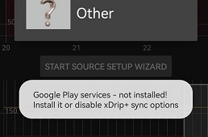
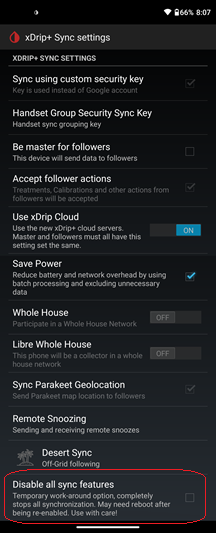

## Google Play Services Not Installed  
xDrip without Google Play Services  
  
August 10, 2022    
  
Do you see this message in xDrip?  
  
  
If you don't want to, or cannot, install Google Play Services, enable (put a check mark beside) the following setting in xDrip.  
  
Settings &#8722;> xDrip+ Sync settings &#8722;> Disable all sync features  
  
    
