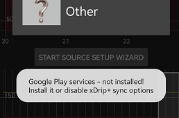
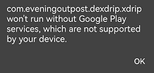

  
# Google Play Services Not Installed
[xDrip](../) >> [Troubleshooting](./Troubleshooting_page.md) >> Google Play Services Not Installed  
xDrip without Google Play Services  
  
Do you see this message in xDrip?  
  

Or, do you get this Android notification?  
  
   
  
If you don't want to, or cannot, install Google Play services, enable (put a check mark beside) the following setting in xDrip.  
  
`Settings` &#8722;> `xDrip+ Sync settings` &#8722;> `Disable all sync features`  
  
  
