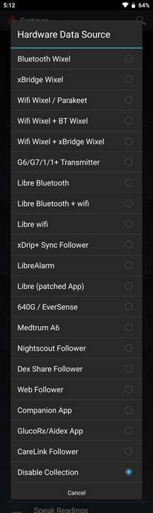

## Hardware Data Source
[xDrip](../README.md) >> [Features](./Features_page.md) >> xDrip Hardware data source  
  
A very important xDrip settings page is `Settings` &#8722;> `Hardware Data Source`.  
  
  
  
On this page, you set the origin of the xDrip incoming data.  
  
  
