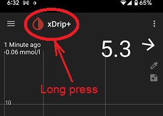

## Home shelf
[xDrip](../README.md) >> [Settings](./Settings.md) >> Home shelf  
  
Some settings can only be accessed on the home shelf.  Those are:  
. Source wizard  
. [Time buttons](./TimeButtons.md)  
. [Time period lock](./TimeButtons.md)  
. Chart preview  
. Collector status  
. [Sensor expiry](./Sensor-Expiry.md)  
. [Graphical trend arrow](./Display/TrendArrow.md)  

To access the home shelf, long press the xDrip icon on the main screen.  
  
   

Home shelf    
  

To exit, just tap on the main screen outside the home shelf.  

  
