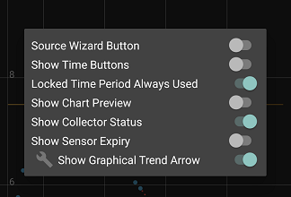

## Home shelf
[xDrip](../README.md) >> Home shelf  
  
Some settings can only be accessed on the home shelf.  
Those are:  
. Source wizard  
. Time buttons  
. Time period lock  
. Chart preview  
. Collector status  
. Sensor expiry  
. Graphical trend arrow  

To open the home shelf, long press the xDrip icon (blood drop) on the main screen.  
  

  
