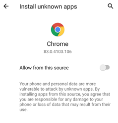

## Installation  
  
After having [downloaded](./Download-xDrip) the .apk file, you can install by tapping on it.  
If you have never installed xDrip on the phone, you will see the following note:  
  
  
Tap on "Settings".  That will bring up this form:  
  
  
Enable "Allow from this source" and go back.  Now, you will see this:  
  
  
Tap on "Install".  
