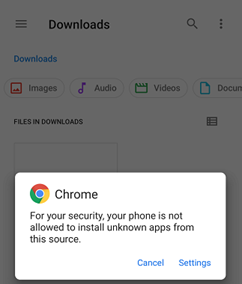

## Install xDrip  
[xDrip](../README.md) >> [Download & Installation](./Installation_page.md) >> Install xDrip  
  
After having [downloaded](./Download-xDrip.md) the .apk file, you can install by tapping on it.  
  
If you already have another xDrip release installed, as long as it is from the [Nightscout foundation xDrip](https://github.com/NightscoutFoundation/xDrip), you don't have to uninstall first.  You can just install over your existing installation.  

But, if you have installed xDrip from another repository, you will not be able to install over it.  In that case, you should [backup](./Backup.md) before uninstalling.  After you install, you will be able to restore your backup to restore your old readings and or your old settings if you want to.  
  
If you have never installed xDrip, you may see the following note:  
  
  
Tap on "Settings".  That will bring up this form:  
  
  
Enable "Allow from this source" and go back.  Now, you will see this:  
  
  
Tap on "Install".  
   
  
You will see unsafe app blocked.  Follow these [instructions](./FAQ/UnsafeAppBlocked.md) to install.  
  
  
