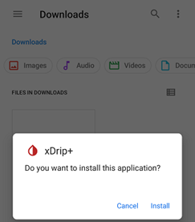

## Install xDrip  
[xDrip](../README.md) >> [Download & Installation](./Installation_page.md) >> Install xDrip  
  
After [downloading](./Download-xDrip.md) the xDrip .apk file, locate it in your file manager and tap on it to start the installation process.  
  
If you have another xDrip release installed from the [Nightscout Foundation](https://github.com/NightscoutFoundation/xDrip), you can install the new version directly over the existing one without uninstalling the previous version.  
  
If xDrip was installed from a different repository, you cannot install the new version over it. In this case:  
Before uninstalling the old version, ensure you [back up](./Backup.md) your data.  Uninstall the existing version.  Proceed with the installation of the new version.  After installation, restore your backup to recover your old readings and settings if needed.  
   
  
---  
  
You may see the following note after attempting to install:  
  
  
Tap on "Settings".  That will bring up this form:  
  
  
Enable "Allow from this source" and go back.  Now, you will see this:  
  
  
Tap on "Install".  
   
  
---  
  
If you see unsafe app blocked.  Follow these [instructions](./FAQ/UnsafeAppBlocked.md) to install.  
  
  
