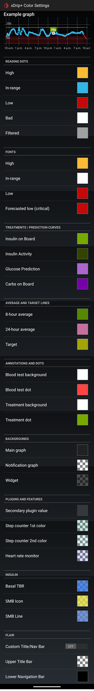
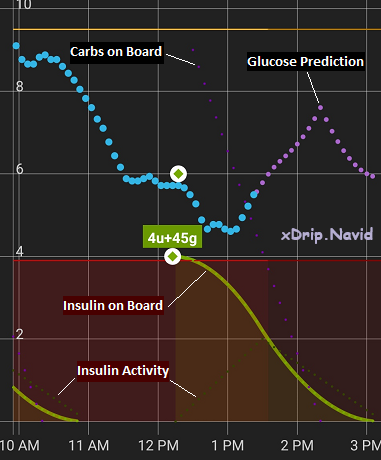
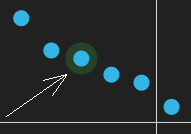
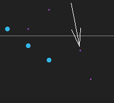
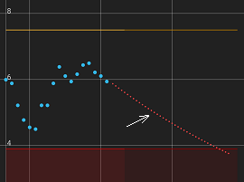

## Legend  
[xDrip](../README.md) >> [Features](./Features_page.md) >> [Display](./Display/Display.md) >> [Legend](./Legend.md)  &nbsp; &nbsp; &nbsp; September 4, 2022  
  
You can customize some colors at: Settings &#8722;> xDrip+ Display Settings &#8722;> xDrip+ Color Settings  
  
The following shows the page, without the example chart.  
  
  
The following image shows a sample main screen with the default treatment/prediction colors and characteristics identified.  
  
  
If you enable backfilled data (Settings &#8722;> xDrip+ Display Settings &#8722;> Graph Settings &#8722;> Show backfilled Data), a reading that is backfilled is highlighted as shown in the following figure.  
  
  
If you enable G6 prediction (Settings &#8722;> xDrip+ Display Settings &#8722;> Graph Settings &#8722;> G6 Predictions), you will see the prediction points as shown below.  
  
  
Enabling Forecast Lows alert will show the extrapolated curve when a low is predicted as shown in the following figure.  
  
