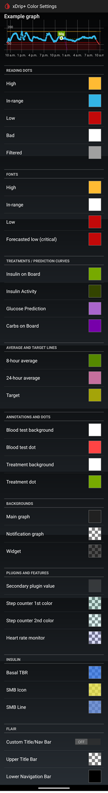
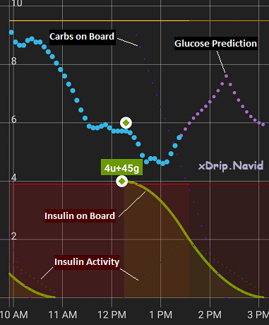
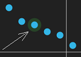
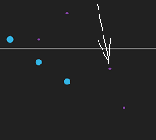
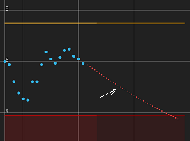

  
# xDrip Legend  
[xDrip](../) >> [Features](./Features_page.md) >> [Display](./Display/Display.md) >> xDrip Legend  
  
You can customize some xDrip colors at: `Settings` &#8722;> `xDrip+ Display Settings` &#8722;> `xDrip+ Color Settings`  
  
The following image shows the page, without the example chart at the top.  
  
  
The following image shows a sample main screen with the default treatment/prediction colors and characteristics identified.  
  
  
If you enable backfilled data (`Settings` &#8722;> `xDrip+ Display Settings` &#8722;> `Graph Settings` &#8722;> `Show backfilled Data`), a reading that is backfilled is highlighted as shown in the following figure.  
  
  
If you are using xDrip as a collector from G6 or G7 and enable `Settings` &#8722;> `xDrip+ Display Settings` &#8722;> `Graph Settings` &#8722;> `G6/G7 Predictions`, you will see the prediction points as shown below.  
  
  
Enabling [Forecast Low alert](./Alerts/ForecastLow.md) will show the extrapolated curve when a low is predicted as shown in the following figure.  
  
  
