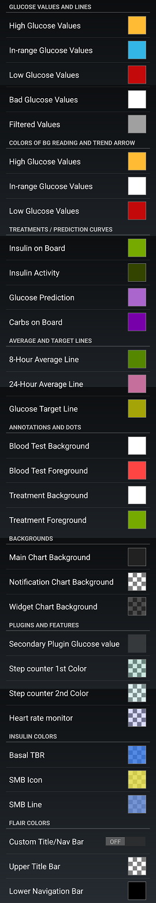
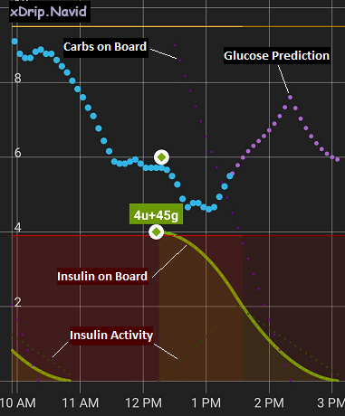

## Legend  
  
You can customize some colors at: Settings &#8722;> xDrip+ Display Settings &#8722;> xDrip+ Color Settings  
  
The following shows the same page with a few descriptions edited for clarity.  
  
  
The following image shows a sample main screen with the default treatment/prediction colors and charactersitics identified.  
  
