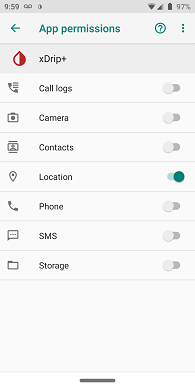
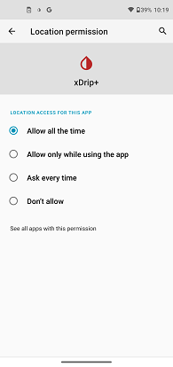
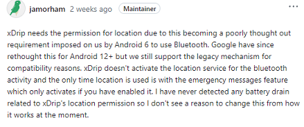

  
# Location Access
[xDrip](../) >> [Download & Installation](./Installation_page.md) >> xDrip Location access  
  
If you want to use xDrip as your collector, the app that receives readings from the sensor, you need to enable the Android Location service on your phone.  
If you use xDrip as a follower, you will not need to enable the location service.  
   

---  
  
#### **How to enable the location service**  
  
Go to Android Settings.  
Search for xDrip.  Under "Apps" or "Apps info", and not under "Accessibility", tap on xDrip.  
Tap on "Permissions".  
  
On Android 10 and older, you will see this:  
  
  
Enable "Location".  
   
  
On Android 11 and newer, tap on "Location".  You will see this:  
  
  
Enable "Allow all the time".  
   
   

---  
  
#### **Why is location service required?**  
   

    
