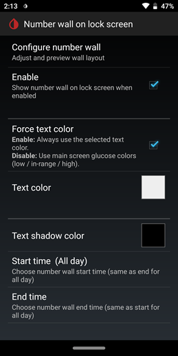

  
# Lock Screen
[xDrip](../) >> [Display](./Display/Display.md) >> Lock screen  
  
You can set xDrip to show your blood glucose reading and an image on the lock screen when the phone is not being charged.  
To do this, go to `Settings` &#8722;> `xDrip+ Display Setting` &#8722;> `Number wall on lock screen`.  
  
  
  
Configure number wall lets you customize the reading text color and position on the screen, as well as choose an image for the background.  
Enable `Use on Lock screen`.  
  
Disable `Force text color` to use the same glucose colors as on the main screen.  
  
When the phone is being charged, the [Android screen saver](./Screensaver.md) takes priority over this setting.  

  
