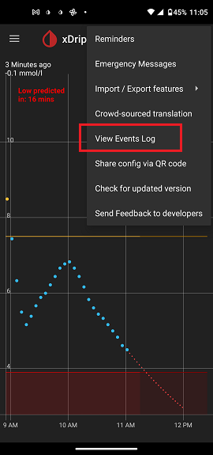
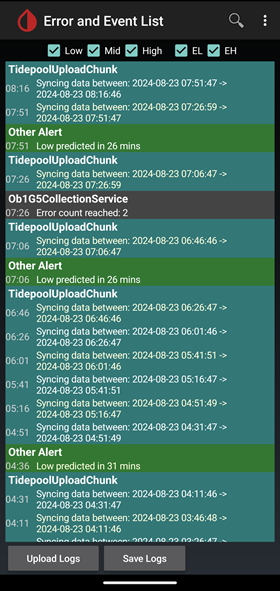

## Logs
[xDrip](../README.md) >> [Features](./Features_page.md) >> xDrip Logs  
  
To view the logs, tap the ellipsis (three dots) menu button in the top right corner and choose `View Events Log`.  
  
  
This will open a new screen titled “Error and Event List.” You can scroll up and down to navigate through the logs and access older entries. The newest logs are displayed at the top.  
  
  
The logs may contain user IDs, passwords or serial numbers.  Be careful whom you are sharing them with and hide (blackout) sensitive content if necessary.  
  
At the top of the screen, you can choose different categories of logs to be shown.  Please enable all if sharing logs through a screenshot with someone trying to help you troubleshoot.  
  
At the bottom, you can tap on `Save Logs` to save a text file containing the logs.  
  
