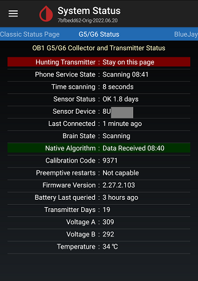

## How to trigger a pair request
[xDrip](../README.md) >> [Features](./Features_page.md) >> [Dexcom](./Dexcom_page.md) >> Pair Request with xDrip  
  
Tap on `Settings` &#8722;> `Dexcom Transmitter ID`.  
  
Make a record of the code.  Either write it down or take a snapshot.  
Change the last character to something else and apply.  
Then, change the last character back to the original correct value and apply.  
Now, go to the system status page.  
  
You will see `Hunting Transmitter` in red on that page.  
  
  
In up to 5 minutes, you should receive a pair request if you have Android 10 or newer.  Be sure to approve a pair request.  
If you have Android 9 or older, you will never get a pair request.  The phone will pair automatically.
  
If the phone screen is locked, unlock it and pull down from the top to see the notifications.  Open the pair request notification and approve.  
  
