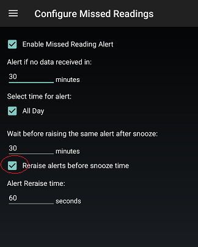

  
# Missed Reading Alert not repeating
[xDrip](../) >> [Features](./Features_page.md) >> [xDrip Alerts](./Alerts_page.md) >> xDrip Missed reading alert not repeating  
  
If you want the xDrip missed reading alert to repeat until you snooze it, you need to enable "Reraise alerts before snooze time".  
By default, the setting is disabled.  
  
