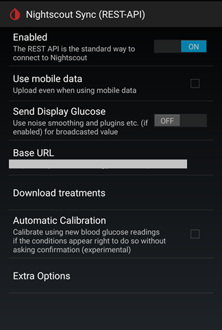

## Nightscout Settings  
  
To enable Nightscout uploader (master), go to the following page.  
Settings &#8722;> Cloud Upload &#8722;> Nightscout Sync (REST-API)  
  
  

At the top of the page, enable the function.  
Tap on Base URL.  Enter the following:  
https<nolink>://password@userID.herokuapp.com/api/v1/  

"password" is the "API_SECRET" you can find under your heroku config vars.  

The following is what you enter in a web browser to see your readings, as well as what a Nightscout follower needs to follow you.  
https<nolink>://userID.herokuapp.com  
