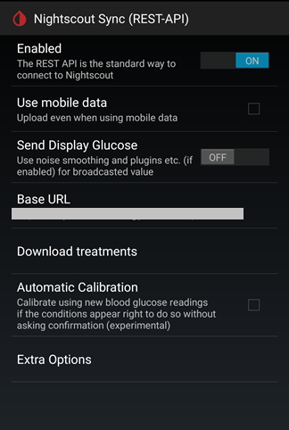

## Nightscout Uploader Settings
[xDrip](../README.md) >> [Features](./Features_page.md) >> [Nightscout](Nightscout_page.md) >> Nightscout Master
  
To enable the Nightscout uploader (master), follow these steps:  
  
1- Go to `Settings` &#8722;> `Cloud Upload` &#8722;> `Nightscout Sync (REST-API)`.  
  
  

2- At the top of the page, enable the function.  
  
3- Tap `Base URL` and enter it in the following format:  
https<nolink>://password@hostname/api/v1/  

- "password" is the "API_SECRET" you can find in your Nightscout variables.  
- "hostname" is the URL you use to access Nightscout in a browser (excluding https<nolink>://).  
   

Example:  
If your hostname and password are as follows:  
- Hostname: `jane.us.to`  
- Password: `3MyPassword4NS`  

Then, your correct URL will be:  
https<nolink>://3MyPassword4NS<nolink>@jane.us.to/api/v1/  
    
  
---  
  
#### **Disable a follower**  
To disable a follower, you can remove the token associated with that follower.  
- If multiple followers use the same token, you’ll need to change it and inform those you want to continue following you.
- If you’ve shared your API_SECRET with the follower, you’ll need to update it.  
   

---  
  
#### **Upload to multiple Nightscout sites**  
You can upload to more than one Nightscout site, but there is an important limitation:  
- If you upload to a single site and it goes down, xDrip will queue the readings and upload them once the site is restored.
- If you upload to multiple sites and one goes down while another remains functional, xDrip clears the queue as soon as any site successfully uploads.  As a result, readings that were not uploaded to the downed site will be missing.  xDrip will [notify](./Nightscout/MultiSiteUpload.md) you so that you can backfill the missing data.  
  
To upload to multiple Nightscout sites, enter the URLs in the same field, separated by spaces.  
   

---  
  
#### [Nightscout](./Nightscout_page.md)  
#### [Tokens](./Nightscout/Tokens.md)  
  
