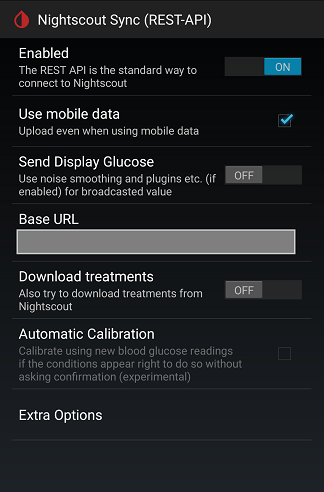

## Nightscout Settings
[xDrip](../README.md) >> [Features](./Features_page.md) >> [Nightscout](Nightscout_page.md) >> Nightscout master
  
To enable Nightscout uploader (master), go to the following page.  
Settings &#8722;> Cloud Upload &#8722;> Nightscout Sync (REST-API)  
  
  

At the top of the page, enable the function.  
Tap on Base URL.  Enter the following:  
https<nolink>://password@hostname/api/v1/  

"password" is the "API_SECRET" you can find in your Nightscout variables.  
"hostname" is the URL you use to access Nightscout in a browser excluding https<nolink>://  
   
   
  
---  
  
**Upload to multiple Nightscout sites**  
Enter the URLs in the same field, separated by space.  
  
