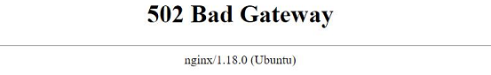

## 502 Bad Gateway
[xDrip](../../README.md) >> [Features](../Features_page.md) >> [Nightscout](../Nightscout_page.md) >> [Google Cloud](./GoogleCloud.md) >> 502 Bad Gateway  
  
Do you get this error when you attempt to access your Nightscout in a browser?  
   
  
  
   
   
  
This could have been caused by having run bootstrap and not having followed by executing Install Nightscout phase 1.  
Please run Install Nightscout phase 1 from the Google Cloud setup submenu.  Then, please restart the server from the main menu.  
  
After restast, if the problem persists, please [contact us](../Contact.md).  
  
  
