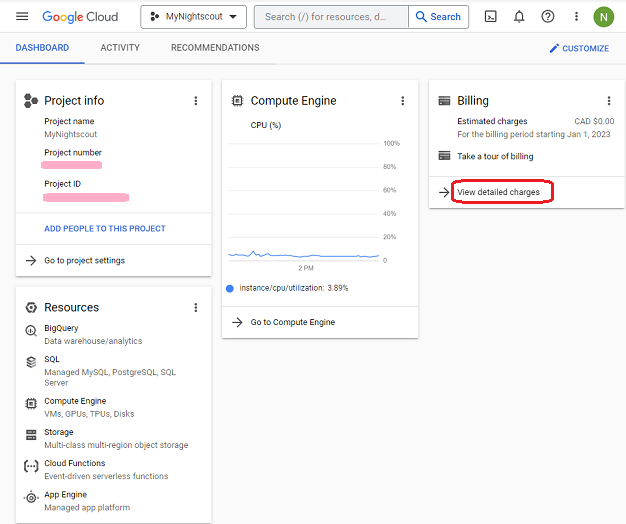
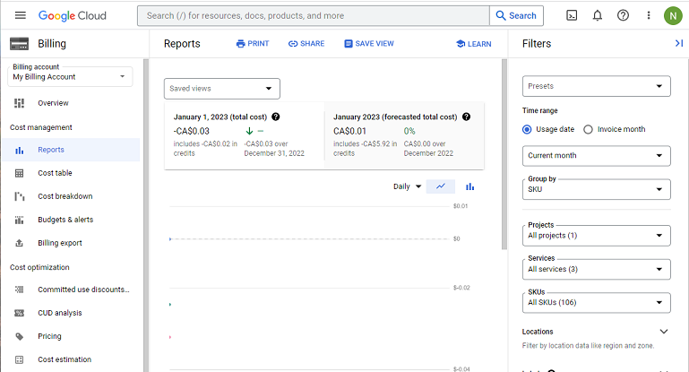

## Google Cloud Nightscout Billing
[Google Cloud Nightscout](./GoogleCloud.md) >> Billing  
  
Go to the [Google Cloud](https://cloud.google.com/).  
Sign in.  
Click on "Console".  
  
  
Go to the dashboard.  
  
  
Click on "View detailed charges" under "Billing".  If you don't see it, you can customize the dashboard (top right corner) and make the billing card visible.  
  
  
  
  
  
