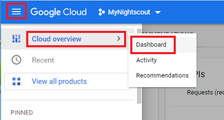

## Nightscout on Google Cloud Billing
[xDrip](../../README.md) >> [Features](../Features_page) >> [Nightscout](../Nightscout_page) >> [Nightscout on Google Cloud](./GoogleCloud) >> Billing  
  
Go to the [Google Cloud](https://cloud.google.com/).  
Sign in.  
Click on "Console".  
  
  
Go to the dashboard.  
  
  
Click on "View detailed charges" under "Billing".  If you don't see it, you can customize the dashboard (top right corner) and make the billing card visible.  
  
  
  
  
  
