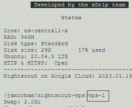

## Google Cloud Nightscout branches
[Google Cloud Nightscout](./GoogleCloud.md) >> Branches  
  
Google Cloud Nightscout has two branches that you can use:  
  
* Development Branch (vps-dev): This branch receives updates first and is therefore less tested. You can access the latest updates sooner with this branch.  
  
* Stable Branch (vps-1): This branch is updated after new features have been tested on the development branch for a while. It is updated by promoting a release from the development branch and is therefore more stable.  
   
  
---  
  
#### **Updates**  
When you [update the platform](./NS_SyncExecutables.md), you receive the latest release in the branch you are using.  
   
  
---  
  
#### **Comparison**  
To see the differences between the two branches, refer to the [release notes](./GC_ReleaseNotes.md).  
   
  
---  
    
#### **Switching Branches**  
If you want to switch branches while using Google Cloud Nightscout, follow these steps:  
  
1- Run “Bootstrap” associated with the branch you want to switch to from the [Google Cloud setup submenu](./Menu.md).  
2- Run “Install Nightscout Phase 1” from the Google Cloud setup submenu.  
  
After switching branches, [restart the server](./Restart.md) to ensure everything works as expected. If issues arise, run “Install Nightscout Phase 2” as well. You will be prompted to change the API_SECRET; press ESC to keep it unchanged. You will also be asked for FreeDNS account credentials; press ESC again to retain the current hostname.   
   
  
---  
   
#### **Which branch am I using?**  
To determine which branch you are using, go to the status page. The full GitHub path is displayed on the status page, and the last section of the line indicates vps-1 for the stable branch or vps-dev for the development branch.   
  
   
  
---  
  
#### **Which branch should I use?**  
The choice of branch depends on your needs:  
  
Use the development branch if you are confident with technology and are willing to contribute by testing.  
Use the development branch if you need a feature that is only available there.  
Use the stable branch if you prefer stability and the stable release meets all your needs.  
  
