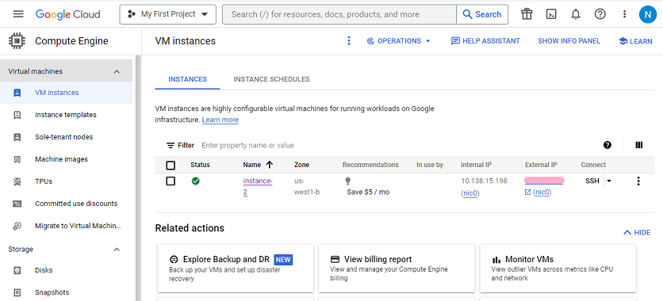

## Compute Engine
[xDrip](../../README.md) >> [Features](../Features_page) >> [Nightscout](../Nightscout_page) >> [Nightscout on Google Cloud](./GoogleCloud) >> Dashboard  
  
Go to the [Google Cloud](https://cloud.google.com/).  
Sign in.  
Click on "Console".  
  
  
Go to the dashboard.  
  
  
Click on "Compute Engine".    
  
  
  
  
  
