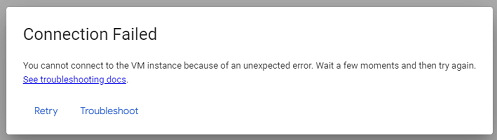

## Virtual machine connection failed
[xDrip](../../README.md) >> [Features](../Features_page.md) >> [Nightscout](../Nightscout_page.md) >> [Google Cloud](./GoogleCloud.md) >> Connection Failed  
  
You may experience a connection failed error.  
  
  
That will be an expected error after a reboot.  
But, you may even experience the error unexpectedly.  
In that case, wait 30 seconds;  then, click on retry to reconnect;  then, reboot the server.  Now, you will experience the same erro.  But, this time it is expected.  Now, when you bring up the terminal again, you can retry what led to the original disconnect.  
 
