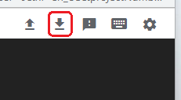

## Google Cloud Nightscout Backup
[Google Cloud Nightscout](./GoogleCloud.md) >> Backup  
  
You must have Nightscout [installed and operational](./GoogleCloud.md) for this to work.  
A video clip[ is included to help with the instructions.  
  
**Backup**  
Open a [terminal](./Terminal.md).  Select "Backup MongoDB and variables" from the Data submenu.  
A compressed archive file with the name you choose will be created in the current directory, containing the MongoDB database and variables.  
  
**Transfer the backup**  
Transfer the backup off the virtual machine to avoid losing it if the machine is deleted.  
First, exit the menu to return to the command line.  
Type `pwd` and press Enter.  You will see a path like /home/jane.  
By default, you will be in your home directory. If your Linux user ID is jane, your home directory will be named jane and will be located under /home.  
  
Type `ls` and press Enter to list the files in your directory, including the backup file you just created. Note the filename.  
  
Click on "Download" at the top of the terminal.  
  
Enter the full path to the backup file. For example, if the backup filename is backup_Nov042022, the full path would be /home/jane/backup_Nov042022.  
  
Click on “Download” to start downloading the backup file to the device you're using to access the virtual machine.  
  
If the terminal disconnects during the download and shows a [disconnect error](./images/Disconnect.png), wait a moment and click “Retry” to reconnect. Try downloading again, and it should proceed.  
  
Ensure you keep the backup file in a safe location.  

<video width="400" controlsList="nodownload" src="./video/Backup.mp4" controls>  
</video>  
  
   
  
---  
  
[Restore](./DatabaseRestore.md)  
  
