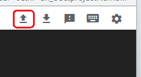
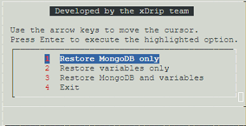

## Google Cloud Nightscout Restore
[Google Cloud Nightscout](./GoogleCloud.md) >> Restore  
  
You must have Nightscout running following [install](./NS_Install.md) instructions for this to work.  
  
Open a [terminal](./Terminal.md).  
Click on upload at the top on the terminal.  
  
  
Click on "Choose Files".  Select the backup file you created following [these](./DatabaseBackup.md) instructions, and click on "Upload".  
The file will be uploaded into the virtual machine in the working directory.  

Type and enter menu to bring up the [menu](./Menu.md).  Choose "Restore MongoDB and/or variables" from the Data submenu.  
Select the backup file and press space so that it is added and shown on the full path at the bottom.  Press enter to proceed with restore.  
Depending on the content of the backup file, you will see a menu like the one shown below.  
  
If the backup contains both Mongo database and variables, you can choose, using the menu, to only restore one or both.  

If you choose to restore the Mongo database, the backup content will be added to the database.  
  
