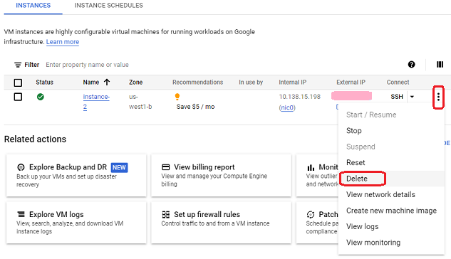

## Delete virtual machine
[xDrip](../../README.md) >> [Features](../Features_page) >> [Nightscout](../Nightscout_page) >> [Nightscout on Google Cloud](./GoogleCloud) >> Delete virtual machine  
  
If you delete a virtual machine, all the data on the virtual machine will be deleted.  It is a good idea to backup everything before proceeding.  
If you have just created the machine, you can delete it with no worries as you have not added any data to the machine.  
  
Go to the [Compute Engine](./ComputeEngine.md).  
  
Choose "Delete" from the 3-dot menu.  
  
  
  
