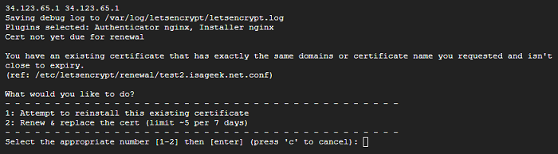

## Existing Certificate
[Google Cloud Nightscout](./GoogleCloud.md) >>  Existing certificate  
  
If you run "install Nightscout phase 2" again shortly after having run it before, you may get a note claiming that there is an existing certificate.  
  

This may be required if "install Nightscout phase 2" fails the first time.  

If you experience this, choose 2.  
  
