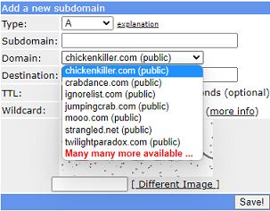
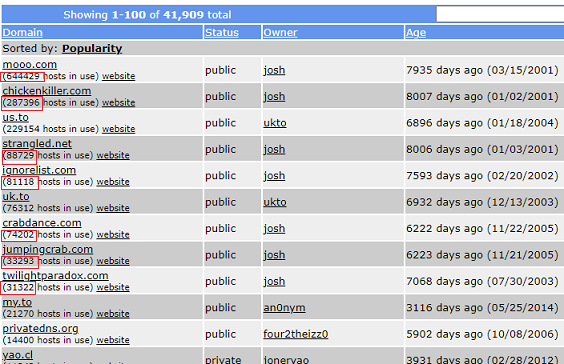
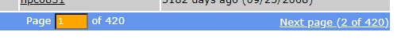

## FreeDNS blocked domains
[xDrip](../../README.md) >> [Features](../Features_page) >> [Nightscout](../Nightscout_page) >> FreeDNS blocked domains  
  
It may be best to choose a domain that is not too popular.  It has been reported that some hostnames are blocked by some schools and or work networks.  You can have a total of 5 different FreeDNS hostnames for free.  
  
Please log into [FreeDNS](https://freedns.afraid.org/menu/).  Go to [subdomains](https://freedns.afraid.org/subdomain/).  Click on Add.  You will see the following from the domain pulldown menu.  
  
  
You  would be wrong to think that the 7 options at the top are your only options.  Please click on "Registry" in the left pane instead.  
  
At the top of the page, you can see the 7 previously mentioned domains.  
  
You can see the number of users under each listing.  mooo.com has more than half a million uers.  It is not surprising that some routers may block it.  
  
Go to [https://urlfiltering.paloaltonetworks.com/query/](https://urlfiltering.paloaltonetworks.com/query/).  
Enter mooo.com and click on search.  You will see that it is categorized as high risk.  
  
On the registry page of FreeDNS, scroll down to the bottom of the page.  There are more than 400 pages!  
  
  
Go through the pages and find a public domain that is categorized as low risk when you test using the link provided above.  Also take into account the number of users.  You may be better off if you choose a domain with a small number of users on it.  
  
After selecting a domain, click on it in the left column.  Doing that takes you back to the subdomain page with the domain selected.  Now, enter a subdomain and proceed to activate it and create a hostname as explained [here](./FreeDNS.md).  
  
