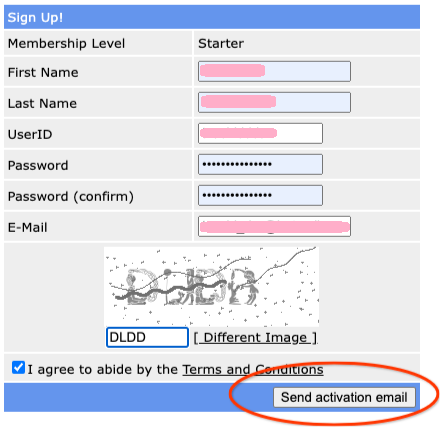
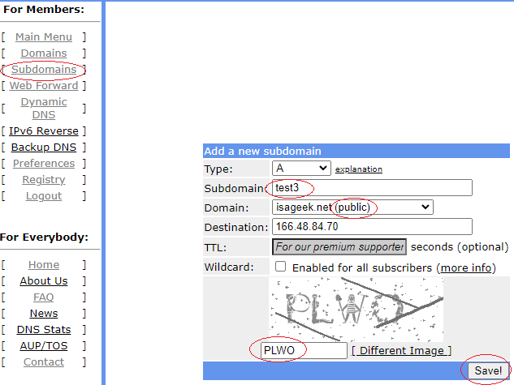
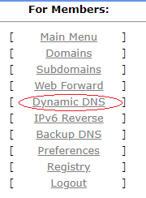
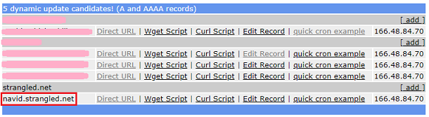
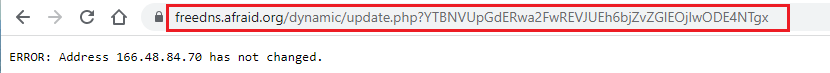

## Free DNS
[xDrip](../../README.md) >> [Features](../Features_page.md) >> [Nightscout](../Nightscout_page.md) >> [Google Cloud](./GoogleCloud.md) >> FreeDNS  
  
Go to FreeDNS site: [https://freedns.afraid.org/](https://freedns.afraid.org/)  
Sign up Free  
Send activation email.  
  
Open email and activate your account.  
Click on Main Menu to log in.  
Go to [Subdomains](https://freedns.afraid.org/subdomain/).  
Add.  
Enter a subdomain name.  Pick a public domain.  Under the image, enter text (capital) to capture the image you see.  You can ask for a different image if it's not clear.  
Save.  
  
   
  
Go to Dynamic DNS.  
  
   

In the table at the bottom, you can see all your hostnames.  The one we just created is circled in red in the following image.  
  
You will need that hostname.  Take a note.  
In the row containing the hostname you intend to use, which you took a note of, click on "Direct URL".  
  
You will be taken to a web page.  
  
You may see an error message on this page as shown above.  If you see an error message, you can ignore it.  But, what you need is what is in the addressbar.  You need to copy the addressbar contect as the "Direct URL" associated with the hostname.  
With both hostname and direct URL recorded, you can move on to the next step.  
   
   
  
Select "Free DNS setup" from the main menu.  
You will be asked for the hostname and direct URL.  Enter the values you have recorded from the previous steps.  
When the process completes, Nightscout will be running, and accessible through Free DNS.  
