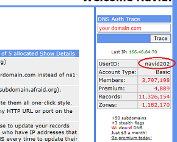

## Free DNS
[Google Cloud Nightscout](./GoogleCloud.md) >> FreeDNS  

Follow these instructions in order to use FreeDNS, which you will need in order to set up Google Cloud Nightscout.  
After everything is set up and working, you will need to log into your FreeDNS account at least once every 6 months, or when you receive a reminder email from them, as explained [here](./FreeDNS_Min_Login.md).  
  
Go to FreeDNS site: [https://freedns.afraid.org/](https://freedns.afraid.org/)  
Click on Sign up Free, and sign up.  Make sure to choose a user ID excluding capital letters.  
If you include capital letters in your user ID, FreeDNS will convert them all to lowercase.  
Please remember your password.  
  
Send activation email.  
  
Open email and activate your account.  
  
To log in, click on "Main Menu" under "For Members".  
After logging in, you can see your user ID at the top right corner.  
  
  
You will need your user ID and password later to use the FreeDNS Setup utility.  Please remember your user ID.  
  
Go to [Subdomains](https://freedns.afraid.org/subdomain/).  
Add.  
  
You can see that under "Domain", you have only 7 options.  Instead of using one of those, it is best to do what is suggested [here](./FD_Domains.md).  
After having selected a public domain, please proceed with the following.  
  
Enter a subdomain name.  Under the image, enter text (capital) to capture the image you see.  You can change the image if it's not clear.  
Save.  
  
   
  
Now, if you go to [Subdomains](https://freedns.afraid.org/subdomain/), you will see your new hostname:  
  
That is what you will be using to access your Nightscout in a web browser.  
   
   
 
