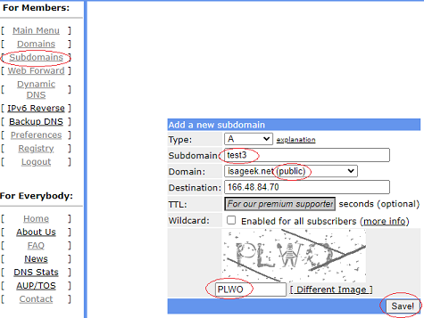

## FREEDNS
[xDrip](../../README.md) >> [Features](../Features_page.md) >> [Nightscout](../Nightscout_page.md) >> [Google Cloud](./GoogleCloud.md) >> FreeDNS  
  
Go to FreeDNS site: [https://freedns.afraid.org/](https://freedns.afraid.org/)  
Sign up Free  
Send activation email.  
  
Open email and activate your account.  
Click on Main Menu to log in.  
Go to [Subdomains](https://freedns.afraid.org/subdomain/).  
Add.  
Enter a subdomain name.  Pick a public domain.  Under the image, enter text (capital) to capture the image you see.  You can ask for a different image if it's not clear.  
Save.  
  
  
Go to Dynamic DNS.  
  

