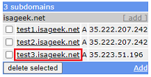

## Free DNS
[xDrip](../../README.md) >> [Features](../Features_page.md) >> [Nightscout](../Nightscout_page.md) >> [Google Cloud](./GoogleCloud.md) >> FreeDNS  

Follow these instructions in order to use FreeDNS, which you will need in order to set up Nightscout on Google Cloud.  
  
Go to FreeDNS site: [https://freedns.afraid.org/](https://freedns.afraid.org/)  
Click on Sign up Free, and sign up.  Make sure to choose a user ID excluding capital letters.  
If you include capital letters in your user ID, FreeDNS will convert it all to lowercase.  You can see that in the email you receive from FreeDNS for email confirmation.  Also, if you log in to FreeDNS, you can see your user ID at the top in the right pane.  
  
You will be asked to enter your user ID and password later on as a part of the installation.  If you enter capital letters, FreeDNS will not authenticate the user ID.  
The best course of action is to avoid capital letters in your user ID.  
  
Send activation email.  
  
Open email and activate your account.  
  
Click on Main Menu to log in.  
After logging in, you can see your user ID at the top right corner.  
  
You will need your user ID and password later to use the FreeDNS Setup utility.  
  
Go to [Subdomains](https://freedns.afraid.org/subdomain/).  
Add.  
Enter a subdomain name.  Pick a public domain.  Under the image, enter text (capital) to capture the image you see.  You can change the image if it's not clear.  
Save.  
  
   
  
Now, if you go to [Subdomains](https://freedns.afraid.org/subdomain/), you will see your new subdomain:  
  
That is what you will be using to access your Nightscout in a web browser.  
   
   
 
