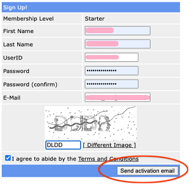

## Free DNS
[xDrip](../../README.md) >> [Features](../Features_page.md) >> [Nightscout](../Nightscout_page.md) >> [Google Cloud](./GoogleCloud.md) >> FreeDNS  
  
Go to FreeDNS site: [https://freedns.afraid.org/](https://freedns.afraid.org/)  
Sign up Free  
Send activation email.  
  
Open email and activate your account.  
Click on Main Menu to log in.  
Go to [Subdomains](https://freedns.afraid.org/subdomain/).  
Add.  
Enter a subdomain name.  Pick a public domain.  Under the image, enter text (capital) to capture the image you see.  You can ask for a different image if it's not clear.  
Save.  
  
  
Go to Dynamic DNS.  
  

In the table at the bottom, you can see all your hostnames.  The one we just created is circled in red in the following image.  
  
You will need that hostname.  Take a note.  
In the row containing the hostname you intend to use, which you took a note of, click on "Direct URL".  
  
You will be taken to a web page.  
  
You may or may not see an error message on this page.  You can ignore the error message on the page.  But, what you need is what is in the addressbar.  You need to copy the entire contect as the "Direct URL" associated with the hostname.  Copy this as well.    
