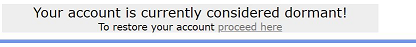
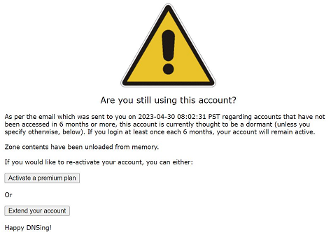

## FreeDNS login frequency
[Google Cloud Nightscout](./GoogleCloud.md) >> FreeDNS login requirement  
  
If you don't login to your FreeDNS account for 5.5 months, you will receive an email from them reminding you that you need to log in.  
Please log into your account.  
If you don't log into your account for 6 months, your account will become dormant and Nightscout will stop working.  
  
This is what the status page will show if your FreeDNS account has gone dormant.  
  
  
Log into your FreeDNS account.  You will see this:  
  
  
Click on "proceed here".  You will see this:  
  
  
Click on "Extend your account".  
  
Access the subdomains page to confirm that your hostname is active again.  
[Restart the server](./Restart.md).  
  
If the hostname is active and you restart the server, the hostname will be mapped to the ip address and Nightscout will resume operation again.  
  
