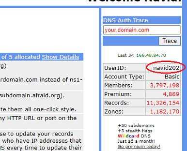

## What is my FreeDNS user ID?
[Google Cloud Nightscout](./GoogleCloud.md) >> FreeDNS user ID  

You can use your email address to log into FreeDNS in a browser.  
But, when you perform installation phase 2, you will need your FreeDNS user ID.  
If you don't remember your FreeDNS user ID, you can log into [FreeDNS](https://freedns.afraid.org/menu/), where your user ID will be shown in the right pane at the top.  
  
  
Or, you can look at the verification email you received when you first signed up for FreeDNS.  It shows your user ID as well.  
  
If you have already completed installation, you can see your FreeDNS user ID and password both by going to the [status page](./Status.md), and at the bottom, selecting `Login credentials`.  
  
