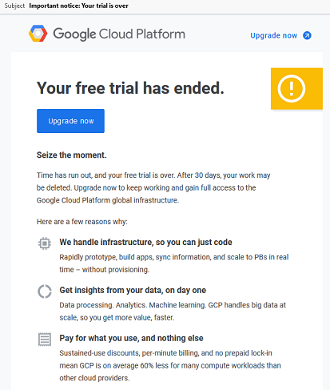
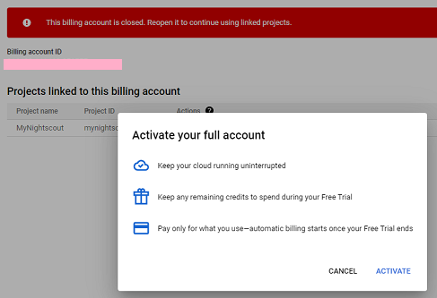
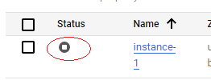
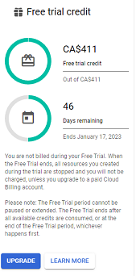

## FreeTrial has ended  
[xDrip](../../README.md) >> [Features](../Features_page) >> [Nightscout](../Nightscout_page) >> [Nightscout on Google Cloud](./GoogleCloud) >> Free Trial End  
  
You should upgrade Google Cloud to avoid any surprises.  
If you don't upgrade, you will receive an email notification as shown below when your free trial ends.  
  
  
Click on "Upgrade now".  You may see the following.  
  
  
Don't panic.  Click on "Activate".  
Go to the console and the Compute Engine.  You will see that the virtual machine has been stopped!  
  
  
Start it.  After the machine starts, you may notice that you still cannot access Nightscout.  This is because restarting the machine after it was shut down for a while has resulted in the machine IP to have been changed.  At this point, the only way to remedy this is to rerun the FreeDNS setup utility.  Doing that will map the new IP to the subdomain.  Then, you will be able to access Nightscout again using the subdomain.  
   
  
---  
  
**Don't wait to upgrade**  
To avoid a surprise interruption in your Nightscout operation, upgrade before your free trial period ends.  
To do that, log into Google Cloud;  go to billing.  You will see the details of your free trial on the page.  
  
  
  
