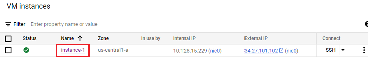
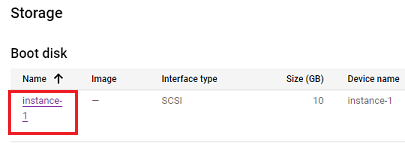
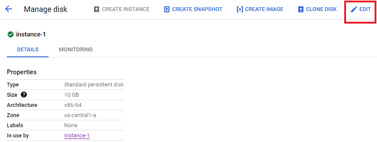
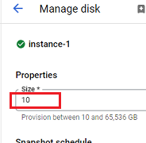
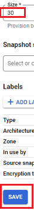
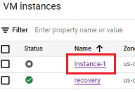
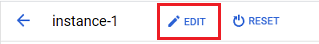
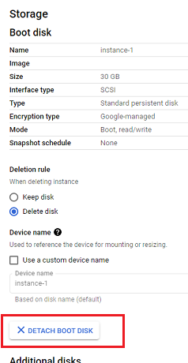

## Google Cloud 30GB Disk
[xDrip](../../README.md) >> [Features](../Features_page.md) >> [Nightscout](../Nightscout_page.md) >> [Nightscout on Google Cloud](./GoogleCloud.md) >> Restore a system with full disk  
  
If you created your setup a long time ago (August 2022) with a 10GB disk and never updated to increase the disk space to 30GB, your system will sooner or later stop to work.  
The best solution is to update before you run into a problem.  
   
  
---  
  
#### **Increase disk size from 10GB to 30GB**  
Go to [Compute Engine](./ComputeEngine.md).  
Under the heading "Name", click on the instance name.  
  
  
Scroll down to "Storage".  After confirming that the disk apce is 10GB, click on the disk name.  
  
  
Now, you need to expand your browser screen horizontally until you can see "Edit" at the top.  Click on "Edit".  
  
  
Edit disk size.  
  
  
Change it to 30GB and save.  
  
   
  
---  
  
#### **Restart the server**
You now need to [restart the server](./Restart.md) so that the filesystem uses the added disk space.  
   
  
---  
  
#### **Full disk**
If you cannot connect to the virtual machine using SSH because the disk is full, even after increasing the disk size to 30GB, you may still not be able to connect.  
This is because Ubuntu needs to adjust the filesystem to use the added disk space.  But, if Ubuntu cannot start, it will not be able to do that.  
  
We are going to create another (recovery) instance to use temporarily to fix this problem.  
There may be a cost involved.  I will use what's needed to minimize cost.  Hopefully, it will be free.  
  
- 1- Create a new instance.  
Follow the same [guidelines](./VirtualMachine.md) for creating the main machine except there is no need to change the disk space to 30GB.  You can leave it at 10GB for the recovery machine.  

- 2- Use SSH to connect to the new machine.  This is very important.  Please don't skip this step.  
 
- 3- Stop the Nightscout instance using the 3-dot menu on the right side of the instance line on the Compute Engine page.  This may take up to 3 minutes to complete.  
 
- 4- Click on the stopped Nighsctout instance name.  
  

- 5- Click on Edit at the top.  
  

- 6- Scroll down to "Storage".  Click on "Detach boot disk".  Click on "Save".  
  
  
