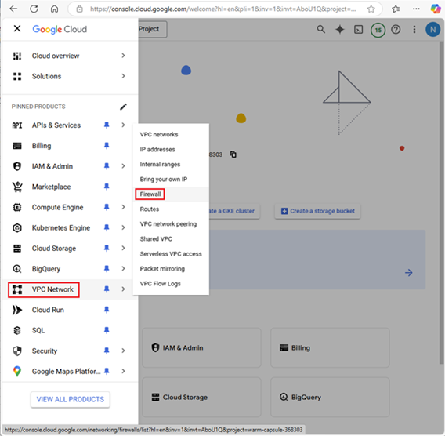
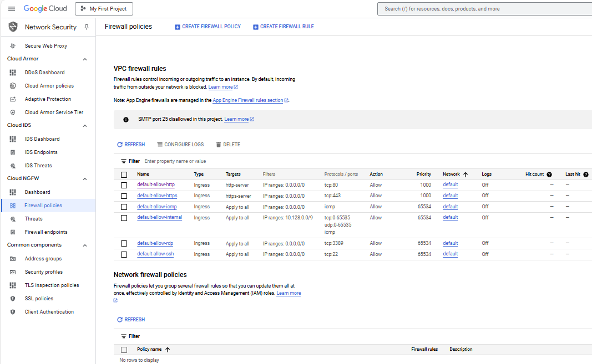

## Google Cloud Firewall  
[Google Cloud Nightscout](../GoogleCloud.md) >> Firewall  
   
  
When you create a virtual machine, it has a firewall already.  To see it, go to your Google Cloud [Dashboard](../Dashboard.md).  
From the menu, select `VPC Network` > `Firewall`.  
  
  
If you have followed our instructions to create a virtual machine, you will see the following.  
.  
   
  
---  
  
#### **Firewall rules**  

If you have not created a virtual machine, you will only see the 4 rules at the bottom.  
The two rules at the top are related to the http and https options you are supposed to enable during the virtual machine setup following our instructions.  
   
  
---  
  
#### **Firewall policies**  
If you want to use geo-location, you will need to create a firewall policy.  But, geo-location is not free.  

  
