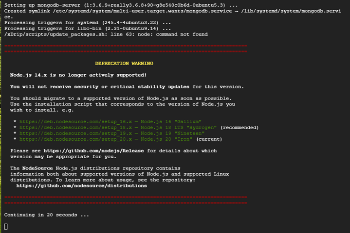

## Deprecation Warning
[Google Cloud Nightscout](./GoogleCloud.md) >> Deprecation Warning  
  
While you are running installation phase 1, you will see a deprecation warning.  
  
  
This is OK.  Please be patient while the installation completes.  
   
  
Node 14 has reached end of life and is not longer receiving updates.  
Nightscout is now updated to use Node 16.  
However, Node 16 does not have much life left either.  And it makes the installation mush slower.  The recommended version to use now is actually Node 18.  

We are waiting for Nightscout to be updated to Node 18, at which point, we will also use Node 18.  
There is no reason to be concerned about this.  There is no dependency to anything in the cloud while using Node 14.  It will run fine regardless.  
It's just that no more security updates are released for it possibly needed for new OS changes.  But, we are not running the latest OS either.  
Our focus is stability rather than offering the latest release of everything.  
  
