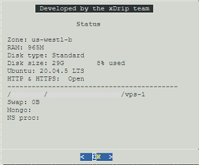
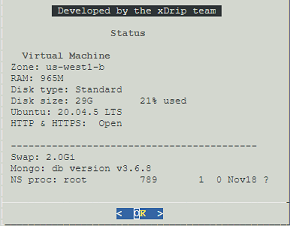

## Nightscout on Google Cloud release notes
[xDrip](../../README.md) >> [Features](../Features_page.md) >> [Nightscout](../Nightscout_page.md) >> [Nightscout on Google Cloud](./GoogleCloud.md) >> Release notes  
  
| Release | Notes | Status page |  
|---------|-------| ----------- |  
| 2023.01.07 | Variable server improvements |  |  
| 2022.12.10 | Copy Nightscout improvements FreeDNS capital letters are rejected. |  |  
| 2022.12.02 | Install heavily dependent on bootstrap |  |  
| 2022.11.27 | FreeDNS name with capital letters |  |  
| 2022.11.21 | Installation improvements |  |  
| 2022.11.19 | Nightscout 14.2.6 - Verify VM region as well |  |  
| 2022.11.11 | Verify virtual machine |  |  
| 2022.11.08 | Variable edit in a browser |  |  
| 2022.11.06 | FreeDNS menus |  |  
| 2022.10.28 | Filter out MongoDB parameters in copy |  |  
| 2022.10.27 | First main menu |  |  
| 2022.10.14 | Customize Nightscout | None |  
| 2022.10.13 | Mongo admin - FreeDNS | None |  
| 2022.09.28 | nginx tweaks | None |  
| 2022.09.26 | Automatic reboot after install | None |  
| 2022.09.23 | Nightscout Clone improvements | None |  
| 2022.09.20 | Nightscout Clone understands tokens | None |  
| 2022.09.19 | 2GB swap | None |  
| 2022.09.14 | Nightscout Clone | None |  
| 2022.08.30 | First release | None |  
