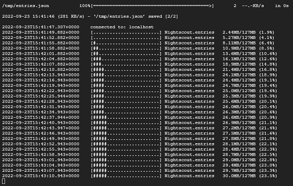

## Data transfer from another repository
[xDrip](../../README.md) >> [Features](../Features_page.md) >> [Nightscout](../Nightscout_page.md) >> [Google Cloud](./GoogleCloud.md) >> [Data Transfer](./GC_Transfer.md)  
  
This is how you can transfer your past readings from another repository, for example, from Heroku.  
  
This will overwrite your existing database.  
  
Open a [terminal](./Terminal).  
Type the following in the terminal and Enter.  
/srv/nightscout-vps/clone_nightscout.sh  
  
You will be asked for site name.  Enter the URL you use to access the source Nightscout site.  For example, https://UserId.herokuapp.com of Heroku.  
You will be asked for a read token.  If the source Nightscout is open to the world, not recommended, you can just hit enter.  If it's not, enter a read token.  You can see [here](./NS_Followers) how to create and use tokens.  
  
After you enter the token, the transfer will start.  
  
  
It may take a while to complete depending on how much data you have in the previous repository.    
