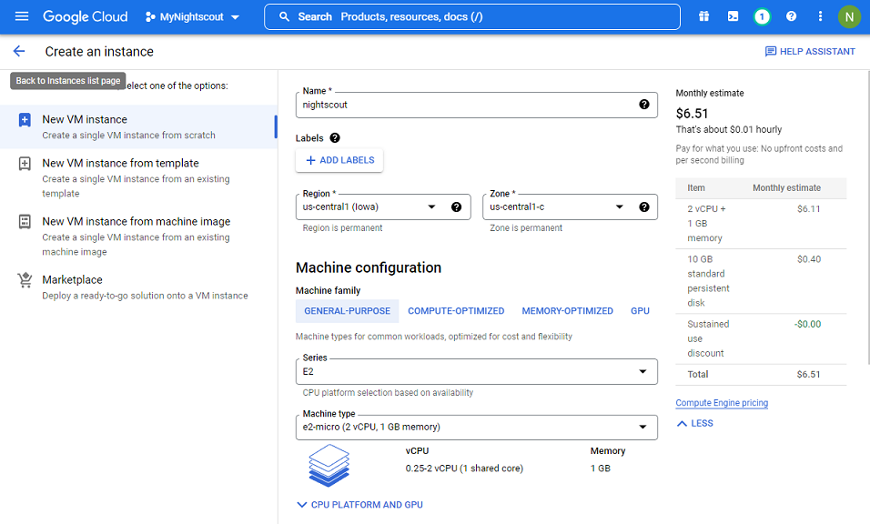
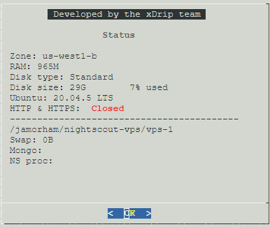

## Nightscout on Google Cloud  
[xDrip](../../README.md) >> [xDrip & Nightscout](../Nightscout_page.md) >> [Nightscout on Google Cloud](./GoogleCloud.md)  
  
This is still a draft and is being tested.  
  
Thanks to jamorham, the current xDrip head developer, for the idea, putting it together, implementing the installer, and testing everything.  
  
You will need a credit card to set up billing.  The plan is to have no billing.  But, we are still testing to confirm that it will be free.  Regardless, a credit card is required.  Unfortunately, you will not qualify if you are in Australia or China.  But, hopefully, other free options will apply to you.    
  
The screenshots have been created from a computerr.  It may be difficult to follow on a mobile device.  
It will take a while (about 90 minutes) to go through the entire setup.  There are suggested break periods.  
  
---  
  
Go to [https://www.noip.com](https://www.noip.com).  
  
   
  
Sign up if you don't have an account.  
You need to enter your email address, choose a password, and choose a hostname.  Make a note of all.  
  
   
  
Select "Free Sign Up" instead of "Get Enhanced".  
  
   
  
Wait for the email and "Confirm Account" before you proceed.  This is a good time for a break.  
  
---  
  
You need a Google account to proceed.  Create one if you don't have one.  
Go to  [https://console.cloud.google.com](https://console.cloud.google.com) and log in with your Google account.  
  
   
  
Create a project.  
  
   
  
Select your new project.  
  
   
  
Go to dashboard.  
  
   
  
Select "Compute Engine".  
  
   
  
Enable.  
  
   

Enable billing.  
  
   
  
Go to https://console.cloud.google.com/
Enable the engine again.  It will ask you to enable billing again.  But, this time, select the billing account you just created.  
Enable billing for your new project.  
  
   
  
You will be asked to select your country and describe your organization.  Select "Personal project".  
  
   
  
Enter billing details.  Select "Start free trial".  This is a good time for a break.   
  
---  
  
You can have a look at the following, the [Google Cloud Free Program features, "Free Tier" section](https://cloud.google.com/free/docs/free-cloud-features#free-tier).  You will be setting up a virtual machine next.  You will need to carefully select settings that qualify for the free tier category.  
The following snapshots show the current (September 4, 2022) limitations.  
  
  
  
  
  
Go to dashboard.  Select "Create a VM".  
Set name to "nightscout".  
Set machine type to "e2-micro".  
Select a region that qualifies for free tier.  
  
  
   
  
Edit "Boot Disk" and modify as shown below.  
  
   
  
Under firewall, enable both http and https.  
  
   
  
Click on "Create" to create the virtual machine.  Google will not bring up your virtual machine.  You can take a break now.  
  
---  
  
After the external IP address column is populated, click on "SSH" on the right side of the IP address.  A terminal will appear shortly.  

Copy and paste the following line into the virtual machine terminal.  Be very careful not to copy it into any other machine as it will overwrite the contents of the machine.  

curl https://raw.githubusercontent.com/jamorham/nightscout-vps/vps-1/bootstrap.sh | bash  
  
This could take a while.  If you get an error message that says EINTEGRITY ending with (0 bytes) and it hangs, Just press CTRL and C keys at the same time to interrupt.  Then, re-run the curl bootstrap command.  
After the installation is completed, you will be asked to login.  
  
   

Use the email address and password you used to register for noip.com to log in.  
Leave the update interval at 30.  
select N for running command during update.  
Enter email address.  
Press A to accept the terms of service.  
Press N to decline sharing email address.  
Select 2 to redirect to secure https.  
The API secret will be your Nightscout password.  Enter a password and take note.  
