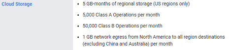

## Nightscout on Google Cloud  
[xDrip](../../README.md) >> [Features](../Features_page) >> [Nightscout](../Nightscout_page) >> [Nightscout on Google Cloud](./GoogleCloud)  
  
#### **Credit:**    
Thanks to jamorham, the current xDrip head developer, for the idea, putting it together, implementing the installer, testing everything, and providing instructions.  
   
  
We used to set up Nightscout on Heroku for free.  Heroku have decided to end their free offering on November 28, 2022.    
We are currently testing this.  We need to confirm that it will be free.  We will know soon.  
  
If you are confident with tech and have time and are interested, you can try this.  Please provide feedback.  
  
If you already have a working Nightscout on Heroku, there is no rush to switch to this now.  One of the subjects that will be added to this guide, after being tested, will explain how to transfer a database from Heroku (Atlas) to this Google Cloud database.  
  
You will need a credit card to set up billing.  The hope is that this will be free.  Regardless, a credit card is required.  
If you have a follower who is in Australia or China, the data traffic from your server to them will not qualify for Free Tier.  This is based on the following note:  
  
  
The screenshots have been created from a computer.  It may be difficult to follow on a mobile device.  
It will take a while (about 90 minutes) to go through the entire setup.  
   
  
#### 1- ["No IP" registration](./noip_com)
#### 2- [Google Cloud project](./NS_GCProject)
#### 3- [Free Tier virtual machine](./NS_FreeTier)
#### 4- [Linux/Nightscout install](./NS_Install)
#### 5- [Setting up Nightscout](./NS_setup)
#### 6- [Setting up followers](./NS_Followers)  
   
  
#### [Nightscout variables](./NS_Variables)
  
