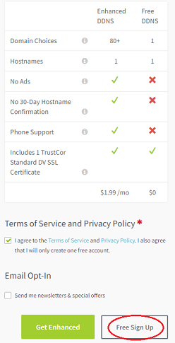

## Nightscout on Google Cloud  
[xDrip](../../README.md) >> [xDrip & Nightscout](../Nightscout_page.md) >> [Nightscout on Google Cloud](./GoogleCloud.md)  
  
This is still a draft and is being tested.  
  
Thanks to jamorham, the current xDrip head developer, for the idea, putting it together, implementing the installer, and testing everything.  

The screenshots have been created from a computerr.  It may be difficult to follow on a mobile device.  
It will take a whileto go through the entire setup.  The sections will be separated, in a future update, identifying times you can have a break.  
  
Go to [https://www.noip.com](https://www.noip.com).  
  
   
  
Sign up if you don't have an account.  
You need to enter your email address, choose a password, and choose a hostname.  Make a note of all.  
  
    
Select "Free Sign Up" instead of "Get Enhanced".  
  
  
Wait for the email and "Confirm Account".  
  
You need a Google account to proceed.  Create one if you don't have it.  
Go to  [https://console.cloud.google.com](https://console.cloud.google.com)  and log in with your Google account.  
  
  
Create a project.  
  
  
Go to dashboard.  
Select "Compute Engine".  
Enable.
Enable billing.  
Go to https://console.cloud.google.com/
Enable the engine again.  It will ask you to enable billing again.  But, this time, select the billing account you just created.  
Standard disk  
Minimal  
Create  
curl https://raw.githubusercontent.com/jamorham/nightscout-vps/vps-1/bootstrap.sh | bash  
If you get an error message that says EINTEGRITY ending with (0 bytes) and it hangs. Just press CTRL C keys at the same time and re-run the curl bootstrap command.  
You will be asked to login.  Use the email address and password you use for noip.com.  
Leave the update interval at 30.  
select N for running command during update.  
Enter email address.  
Press A to accept the terms of service.  
Press N to decline sharing email address.  
Select 2 to redirect to secure https.  
The API secret will be your Nightscout password.  Enter a password and take note.  
