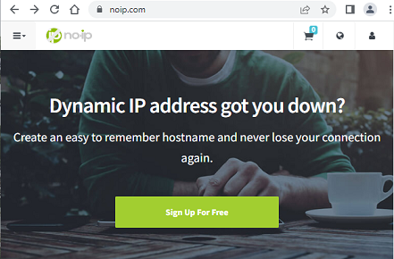

## Nightscout on Google Cloud  
[xDrip](../../README.md) >> [xDrip & Nightscout](../Nightscout_page) >> [Nightscout on Google Cloud](./GoogleCloud)  
  
**Credit:**  
Thanks to jamorham, the current xDrip head developer, for the idea, putting it together, implementing the installer, and testing everything.  
   

**Upcoming changes:**  
Disk space change from 10GB to 30GB  
Script update  
  
**Who should and who shouldn't try this**  
If you are confident with tech and have time and are interested, you can try this.  Please provide feedback.  
If you already have a working Nightscout on Heroku, there is no rush to switch to this now.  One of the subjects that will be added to this guide, after tested, will explain how to transfer a database from Heroku (Atlas) to this Google Cloud database.  
Whether this will be 100% free or not is still not known.  We will know in a month from now.  
If you want a tested and proven method to switch to once, and be done with it, please be patient and don't try this yet.  We still have lots of time and there is no rush.  
  
  
You will need a credit card to set up billing.  The hope is that this will be free.  But, we are still testing to confirm that it will be free.  Regardless, a credit card is required.  Unfortunately, you will not qualify if you are in Australia or China.  But, hopefully, other free options will apply to you.  
  
The screenshots have been created from a computer.  It may be difficult to follow on a mobile device.  
It will take a while (about 90 minutes) to go through the entire setup.  There are suggested break periods.  
   
   
  
---  
  
**noip.com sign-up**  
  
Go to [https://www.noip.com](https://www.noip.com).  
  
  
Sign up if you don't have an account.  
You need to enter your email address, choose a password, and choose a hostname.  Make a note of all.     
  
  
Select "Free Sign Up" instead of "Get Enhanced".  
  
  
Wait for the email and "Confirm Account" before you proceed.  This is a good time for a break.  
   
   
  
---  
  
**Google account**  
  
You need a Google account to proceed.  Create one if you don't have one.  
   
  
**Google Cloud project**  
  
Go to  [https://console.cloud.google.com](https://console.cloud.google.com) and log in with your Google account.  
  
  
Create a project.  
  
  
Select your new project.  
  
  
Go to dashboard.  
  
  
Select "Compute Engine".  
  
  
Enable.  
  

Enable billing.  
  
  
Go to https://console.cloud.google.com/
Enable the engine again.  It will ask you to enable billing again.  But, this time, select the billing account you just created.  
Enable billing for your new project.  
  
  
You will be asked to select your country and describe your organization.  Select "Personal project".  
  
  
Enter billing details.  Select "Start free trial".  This is a good time for a break.  
   
   
  
---  
  
**Free Tier virtual machine**  
  
You can have a look at the following, the [Google Cloud Free Program features, "Free Tier" section](https://cloud.google.com/free/docs/free-cloud-features#free-tier).  You will be setting up a virtual machine next.  You will need to carefully select settings that qualify for the free tier category.  
The following snapshots show the current (September 4, 2022) limitations.  
  
  
  
  
The above three regions are the regions your virtual machine can be in, not where you have to be in.  
  
  
  
  
  
  
  
You can use the [calculator](https://cloud.google.com/products/calculator) to confirm the price.  
  
  
Go to dashboard.  Select "Compute Engine".  Select the "VM instances" tab in the left pane if it's not already selected.  
Select "Create Instance".  
  
  
Set name to "nightscout".  
Set machine type to "e2-micro".  
Select a region that qualifies for free tier.  
  
  
  
Edit "Boot Disk" and modify as shown below.  Click on "Select".  
  
  
Under firewall, enable both http and https.  
  
  
Click on "Create" to create the virtual machine.  Google will now bring up your virtual machine.  
  
[Delete a VM](./images/DeleteVM.png)  
  
You can take a break now.  
   
   
  
---  
  
**Linux/Nightscout install**  
  
After the external IP address column is populated, click on "SSH" on the right side of the IP address.  A terminal will appear shortly.  
  

Copy and paste the following line into the terminal.  Be very careful not to copy it into any other machine as it will overwrite the contents of the machine.  
curl https://raw.githubusercontent.com/jamorham/nightscout-vps/vps-1/bootstrap.sh \| bash  
   
Enter.  
This is a good time for a break.  
   
   
  
---  
  
**Finalize Linux install**  
  
If you get an error message that says EINTEGRITY ending with (0 bytes) and it hangs, just press CTRL and C keys at the same time to interrupt.  Then, re-run the curl bootstrap command.  You can use the up arrow on the terminal to go back to the previous command.  
  
After the installation is completed, you will be asked to login.  
  
To log into the virtual machine, use the email address and password you used to register for noip.com.  
  
Leave the update interval at 30.  
select N for running command during update.  
Enter email address "used for urgent renewal ...".  
Press A to accept the terms of service.  
Press N to decline sharing email address.  
Select 2 to redirect to secure https.  
  
You will be asked to change the API secret.  This is the password you will login to Nightscout with.  
Enter a password and take note.  
  
When you see the following, the install is complete and you can close the terminal by clicking on X at the top right corner of the terminal.  
  
   
  
**Setting up Nightscout**  
  
Let's say the user ID you chose to sign up on noip.com was "userID", and let's say you chose ddns.net as the host.  
Then, use a web browser and enter https://userID.ddns.net.  This will bring up your Nightscout.  It will ask you for a password.  Use the API secret you chose earlier.  
Check "Remember this device" checkbox to avoid having to re-enter it.  
On first time, Nightscout will ask you to set up a profile for sensitivity etc.  Either enter real values or just click save and then use close button on top right of the screen.  You may need to do this twice.  
   
  
**Setting up xDrip to upload to your Nightscout**  
  
Go to xDrip Settings &#8722;> Cloud Upload &#8722;> Nightscout Sync (REST-API).  
Enable at the top.  
Let's say the user ID and password you used to sign up for noip.com are userID and password.  And let's say you chose ddns.net as the server of noip.com.  
Tap on Base URL.  Enter the following.  
https://password@userID.ddns.net/api/v1/  
  
That's it.  Your xDrip readings should now upload to your Nightscout on Google Cloud.    
