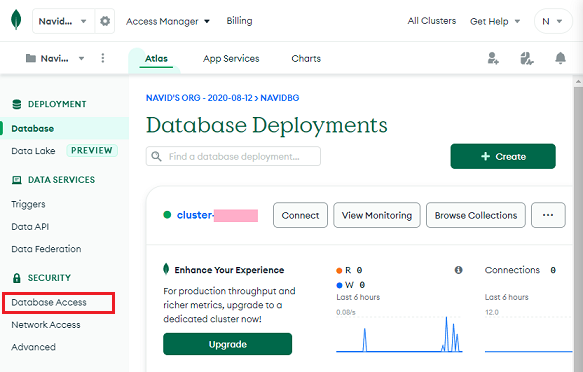
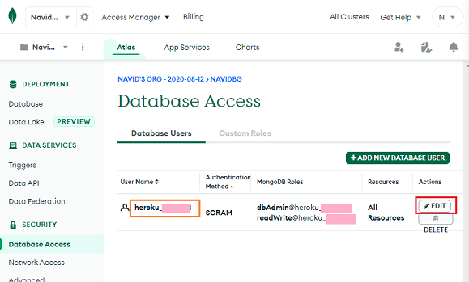
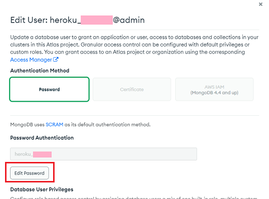

## Heroku is gone! Can I still get my data?  
[xDrip](../../README.md) >> [Features](../Features_page) >> [Nightscout](../Nightscout_page) >> [Nightscout on Google Cloud](./GoogleCloud) >> Import data from Atlas  
  
**Work in progress**  

In order to transfer a database from Atlas, you need to have already completed Nightscout [installation](./NS_Install.md).  
You will need the email address and password you used when you signed up for Atlas.  We all had to do this in 2020.  
Go to [mongodb](https://www.mongodb.com/home) and sign in.  
Take note of the database name (enclosed in orange in the following image).  
  
In the left pane, click on Database Access.  
  
You will be taken to the Database Access page.  Take note of the user name enclosed in orange in the following image.  You will need it later.  
  
On the right, click on "Edit".  
  
You will be taken to the page shown below.  
  
If you don't remember the password or if your password contains special characters, click on Edit Password and change the password.  Take note because you will need it later.  
  
With the username, database name, and password (excluding special characters) in hand, you can log out of Atlas.  
  
Open a [terminal](./Terminal.md).  Exit the menu.  Enter the following into the terminal replacing (U) with username, (D) with database name, and (P) with password.
  
<mark style="background-color: #eFdFef">mongodump --forceTableScan --uri mongodb+srv://(U):(P)@(D).csbuy.mongodb.net/(U) -o /tmp </mark>  
  
Wait for the export process to compete.  It could take a few minutes.  
  
Now, enter the following in the terminal replacing (U) with username.  
  
<mark style="background-color: #eFdFef">mongorestore -d Nightscout /tmp/U </mark>  

Your data is on Atlas, not on Heroku.  Fortunately, you can still get it.  
  
Steps for importing your data from Atlas will be added here shortly.  
