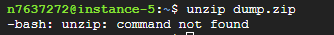
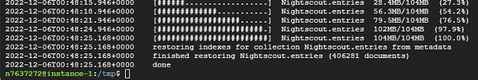

# Import data from Heroku Atlas
[Google Cloud Nightscout](./GoogleCloud.md) >> Import data from Atlas  
  
Regardless of where your Nightscout is, it uses MongoDB.  MongoDB can create a mongodump, which is a binary export of a database's contents.  
  
In order to transfer a database, you need to have already completed Nightscout [installation](./NS_Install.md).  
<br/>   
  
---  
  
#### **Transfer to virtual machine**  
You need to transfer the output of mongodump to the virtual machine.  The output is a folder by default titled "dump".  Compress the folder into a single file.  
[Upload](./Upload_Download.md) the compressed file to your virtual machine.  
  
<br/>
  
---  
  
#### **mongorestore**  
We first need to unzip the file we uploaded to the virtual machine.  
Go to your home directory, where the dump.zip file should be after the upload.  Type and enter the following.  
  
```
unzip dump.zip
```
  
If you see the following message, it means that the unzip command is not installed.  
  
  
If unzip is not installed, type and enter the following two commands in sequence to install it.  

```  
sudo apt-get update
sudo apt-get install unzip
```  
  
If unzip was not installed and you installed it, run the unzip command again.  The dump folder should be in your home directory.  
  
Now, enter the following in the terminal replacing UserName with the user name you copied from the Atlas database access page.  
  
```  
mongorestore -d Nightscout ./dump/UserName 
```  
<br/>  
  
If it succeeds, you will see something as shown below.  
  
  
Wait a minute.  Reload Nightscout in a browser.  Your imported data from Atlas should be present now.  
  
