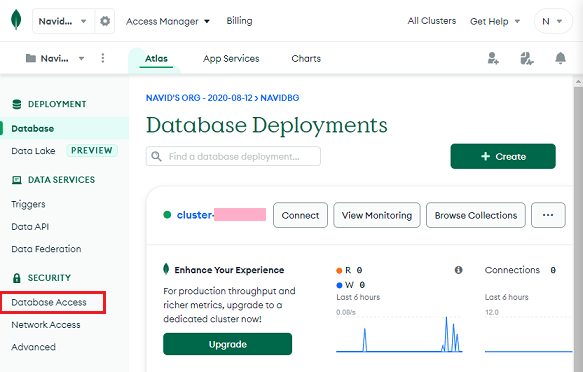
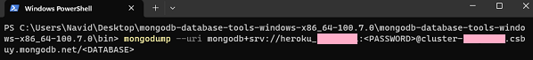
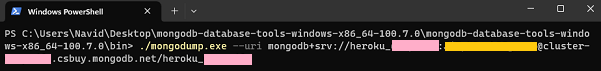

## Import data from Heroku Atlas
[xDrip](../../README.md) >> [Features](../Features_page) >> [Nightscout](../Nightscout_page) >> [Nightscout on Google Cloud](./GoogleCloud) >> Import data from Atlas  
  
Even though Heroku is not free any longer, you can still transfer your database for free as it is on Atlas and not Heroku.  This page explains how to do it.  
In order to transfer a database from Atlas, you need to have already completed Nightscout [installation](./NS_Install.md).  
  
First, you need to use mongodump to get a backup of your database.  Let's assume you want to do that using Windows.  Download the Database tools MSI installer zip file from [this](https://www.mongodb.com/docs/database-tools/installation/installation-windows/) page.  
Let's say you download to your desktop.  
Extract all.  Now, you will have the mongodump.exe file inside the uncompressed folder at: Desktop/mongodb-database-tools-windows-x86_64-100.7.0/mongodb-database-tools-windows-x86_64-100.7.0/bin/mongodump.exe.  We will use this later.  
  
You will need the email address and password associated with your Atlas account.  We all had to sign up in 2020.  
Go to [mongodb](https://www.mongodb.com/home) and sign in.  In the left pane, click on Database Access.  
  
  
You will be taken to the Database Access page.  Take note of the user name (enclosed in orange in the following image).  You will need it later.  
  
On the right, click on "Edit".  
  
You will be taken to the page shown below.  
  
If you don't remember the password (this is not the password you use to log into Atlas) or if your password contains special characters, click on Edit Password and change the password.  Take note of the password because you will need it later.  
  
In the left pane, click on "Database" to go back to the main page.  Click on the 3-dot menu button and click on "Command Line Tools" as shown in the following image.  
  
  
Under "Binary Import and Export Tools", copy the mongodump string.  You can do that by clicking on the copy symbol on the right side of the string, as marked in the image below.  
  
  
Open a [terminal](./Terminal.md).  Exit the menu.  Enter the following into the terminal.  
  
```  
cd /tmp
```  
<br/>  
  
Paste the mongodump string you copied, from the binary import and export tools, into the terminal.  It will be similar to what is shown in the followiong figure.  
  
  
There are three changes you need to make to this.  
1- Replace \<PASSWORD\>, including the brackets, with your Atlas database admin password, which excludes special characters.  
2- Replace \<DATABASE\>, including brackets, with the user name you copied from the Atlas database access page.  
3- Insert \-\-forceTableScan right after mongodump.  
  
What you will have in the terminal after these three changes should look like the following.  
  
Enter.  
  
Wait for the export process to complete.  It could take a few minutes.  If it succeeds, you will see something as shown below.  
  
  
Now, enter the following in the terminal replacing UserName with the user name you copied from the Atlas database access page.  
  
```  
mongorestore -d Nightscout /tmp/dump/UserName 
```  
<br/>  
  
If it succeeds, you will see something as shown below.  
  
  
Wait a minute.  Reload Nightscout in a browser.  Your imported data from Atlas should be present now.  
  
